<!-- GitHub Theme-Aware Hero Banner -->
<picture>
  <source media="(prefers-color-scheme: dark)" srcset="./dark.svg">
  <source media="(prefers-color-scheme: light)" srcset="./light.svg">
  
</picture>

 

<!-- Interactive Quick Badges -->

&nbsp;

&nbsp;

&nbsp;

  

<!-- ═══════════════════════════════════════════════════════════ -->
<!-- ABOUT ME -->
<!-- ═══════════════════════════════════════════════════════════ -->

### ⚡ About Me

> **Full Stack Developer** based in **Batticaloa, Sri Lanka**.  
> I engineer software that eliminates operational friction — building scalable commerce platforms, secure multi-factor authentication (JWT + OTP), and high-throughput inventory tooling.  
> **Philosophy:** *Operational > Decorative &bull; Maintainable > Clever &bull; Secure by Default*

 

<!-- ═══════════════════════════════════════════════════════════ -->
<!-- GITHUB STATS -->
<!-- ═══════════════════════════════════════════════════════════ -->

### 📊 GitHub Analytics

  
  &nbsp;&nbsp;
  

<!-- Verified GitHub Activity Streak -->

 

<!-- GitHub Activity Graph -->

  

<!-- ═══════════════════════════════════════════════════════════ -->
<!-- SELECTED REPOSITORIES -->
<!-- ═══════════════════════════════════════════════════════════ -->

### 🚀 Selected Repositories & Architecture

| Project | Stack | Operational Problem Solved |
| :--- | :--- | :--- |
| **[Shoe Bank](https://github.com/HajithMohamed/Shoe-Bank)** | `MERN` · `JWT` · `OTP` · `Tailwind` | **Production Sneaker E-Commerce:** Secure authentication, OTP verification, real-time inventory decrementing & merchant management. |
| **[NextGen Mobiles](https://github.com/HajithMohamed/NEXTGEN---Sri-Lankan-Mobile-Shop-eCommerce-Website)** | `PHP` · `MySQL` · `Bootstrap` | **Retail Operations Platform:** Replaced manual stock spreadsheets with relational database inventory, supplier logs & warranty tracking. |
| **[Real Estate Listings](https://github.com/HajithMohamed/Real-state)** | `MERN` · `Express` · `MongoDB` | **Property Marketplace:** Multi-parameter search queries, customer inquiries pipeline, and dynamic agent CRUD dashboard. |
| **[Nano Zillas — OOP](https://github.com/HajithMohamed/Nano-_Zillas_Java_Project)** | `Java` · `UML` · `OOP Design` | **Clean Domain Modeling:** Strict adherence to SOLID principles, modular class inheritance hierarchies, and polymorphic design. |

 

<!-- ═══════════════════════════════════════════════════════════ -->
<!-- PRODUCTION TECHNOLOGIES -->
<!-- ═══════════════════════════════════════════════════════════ -->

### 🛠️ Production Technologies

  
  
  
  
  
  
  
  
  
  
  
  
  
  
  
  
  

 

<!-- ═══════════════════════════════════════════════════════════ -->
<!-- GITHUB TROPHIES -->
<!-- ═══════════════════════════════════════════════════════════ -->

### 🏆 GitHub Trophies

  

<!-- ═══════════════════════════════════════════════════════════ -->
<!-- FOOTER -->
<!-- ═══════════════════════════════════════════════════════════ -->

 

*"Write code that works. Write code that evolves."*

 

 

**Available for internships & software engineering opportunities worldwide.**

 

